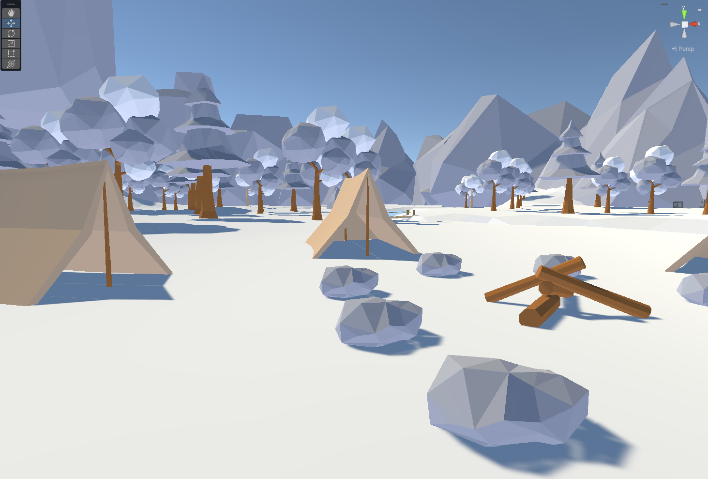

# Snow VR
@Author: Akar (Ace) Htut Kaung

## Summary
The VR environment presented here offers a realistic simulation of a serene winter forest, devoid of modern technology. Upon entering this immersive setting, individuals are instantly enveloped in a cozy and chilly ambiance, providing a unique opportunity to escape the fast-paced and technologically advanced urban areas. This virtual experience offers a tranquil retreat from the modern world, allowing people to reconnect with nature and embrace the simplicity of a snowy winter landscape.

## Demos

